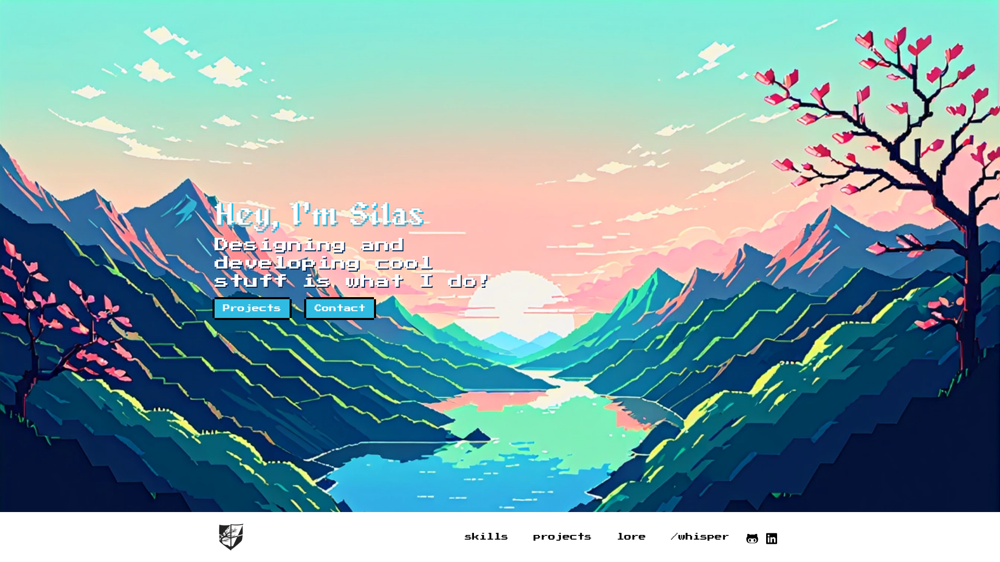

# Silas Cundiff Portfolio :rocket:

> Made with React, Threejs, and Tailwind

Welcome to the repository of my personal portfolio. This project is built using Next.js, Tailwind CSS, and Three.js. It showcases my skills, experience, and projects I've worked on.

## :warning: Under Construction! :warning:

View the wireframes [here!](https://www.figma.com/file/4lVo9k1MzhK1y2SqeayjGt/Zenify-UI-Revamp?type=design&node-id=48%3A215&mode=design&t=iuKOO0dkunUUl19D-1)

## Technologies Used :wrench:

- [Next.js](https://nextjs.org/)
- [Tailwind CSS](https://tailwindcss.com/)
- [Three.js](https://threejs.org/)

Contact :email:
Silas Cundiff - Silvanusdesigns@gmail.com.com

This project was bootstrapped with [`create-r3f-app`](https://github.com/utsuboco/create-r3f-app)
